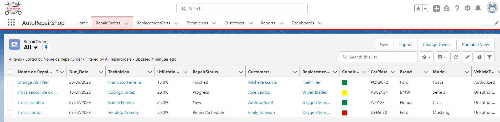
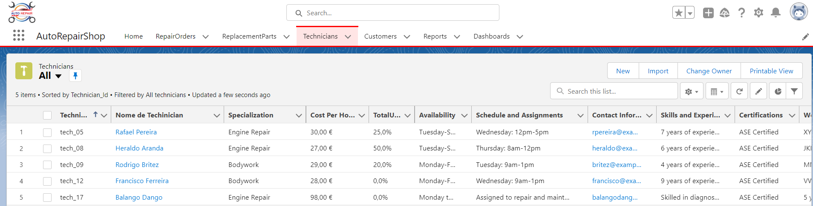
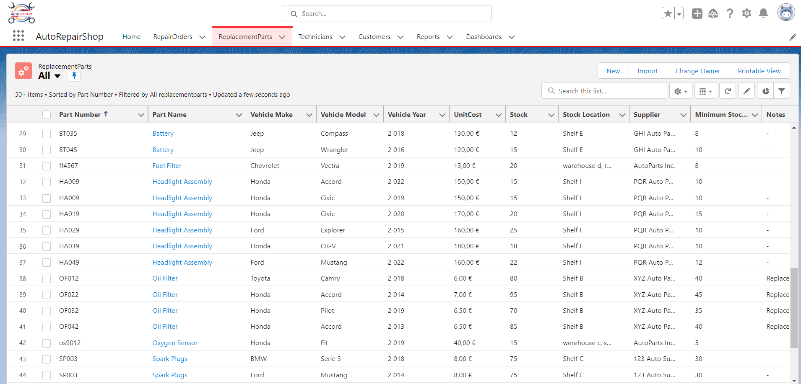
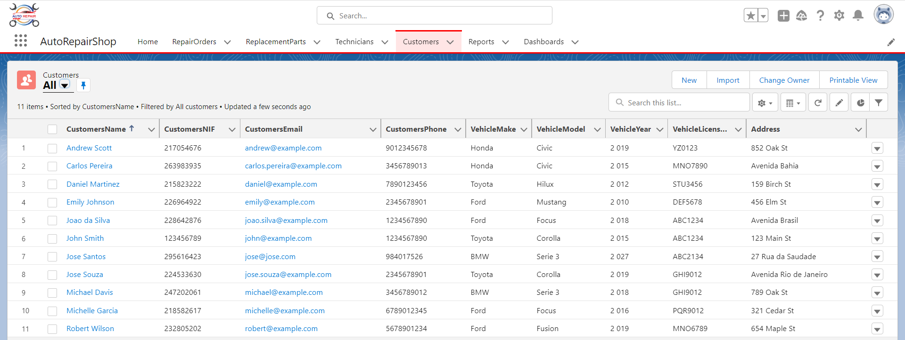
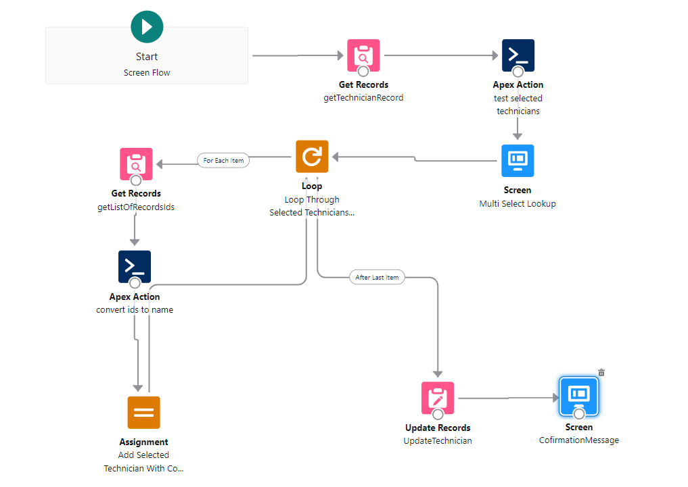
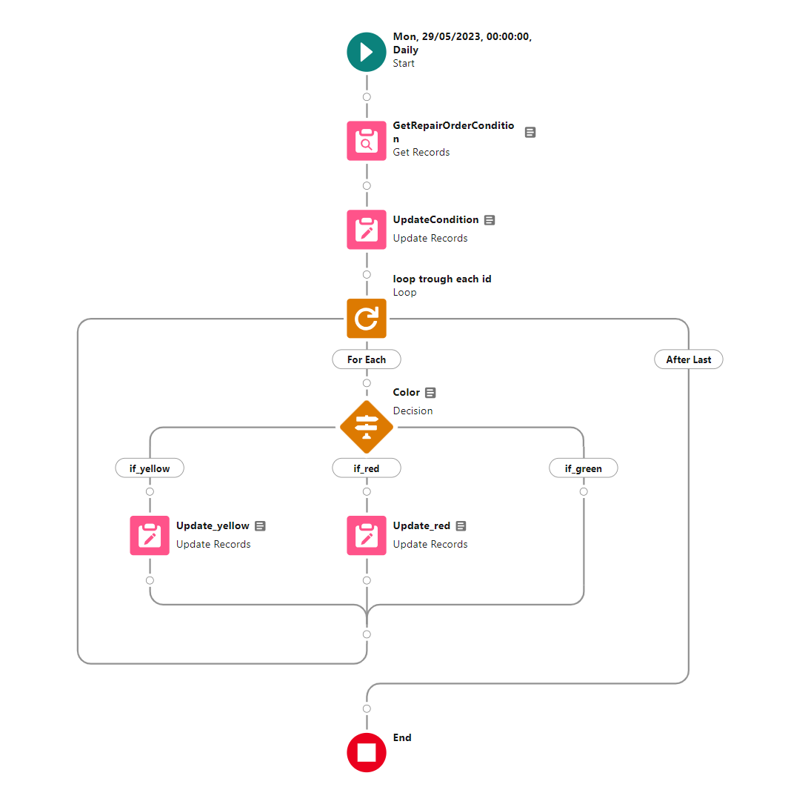
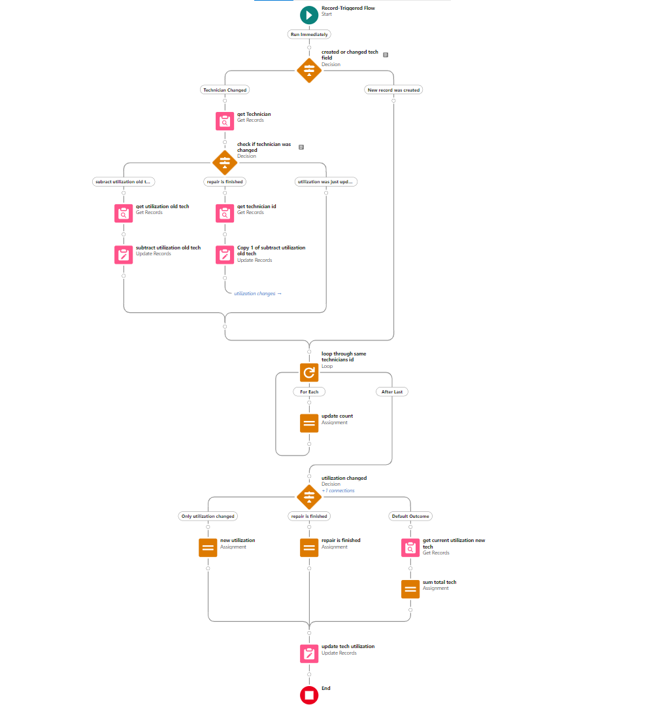

  

    
      
  
 
    
  

      

         
  
 
  
 

  
  
  
  

  

# **Software Cloud Computing - Salesforce Auto Repair Shop**

Este projeto é um sistema de uma oficina mecânica que permite criar e gerenciar técnicos, ordens de reparação e peças de substituição. Abaixo estão listados os requisitos e as funcionalidades implementadas:

## Requisitos do Trabalho

1. **Objetos a serem criados:**

   a. **Technician:** Representa um técnico responsável pelas ordens de reparação.
   
   b. **Repair Order:** Representa uma ordem de reparação com informações sobre o equipamento a ser reparado e o técnico responsável.
   
   c. **Replacement Part:** Representa uma peça de substituição que pode ser utilizada nas ordens de reparação.

2. **Relações many-to-many:**

   As relações entre Technician e Repair Order, e entre Replacement Part e Repair Order devem ser do tipo "many-to-many", permitindo que um técnico possa estar associado a várias ordens de reparação e que uma peça de substituição possa ser utilizada em várias ordens de reparação.

3. **Adaptação das automações existentes:**

   As automações existentes, como Flows, Validation Rules e Triggers, devem ser adaptadas para se adequarem ao novo modelo de dados "many-to-many".

4. **Novo campo e semáforo no objeto "Repair Order":**

   Adicionar o campo "Repair Status" à picklist 'Repair Status' no objeto "Repair Order" com o valor "Behind Schedule". Além disso, criar os seguintes campos:
   
   a. **Due Date:** Campo de data que representa a data limite para a conclusão da ordem de reparação.
   
   b. **Condition:** Campo que funciona como um semáforo, com cores relacionadas ao "Due Date" e ao "Repair Status":
      - Se a ordem de reparação estiver "Finished" antes ou até o "Due Date", o semáforo deve mostrar a cor Verde.
      - Se passarem até 3 dias do "Due Date" e o "Repair Status" ainda não for "Finished", o semáforo deve mostrar a cor Amarela e o "Repair Status" deve ser atualizado para "Behind Schedule".
      - Se passarem mais de 3 dias do "Due Date" e o "Repair Status" ainda não for "Finished", o semáforo deve mostrar a cor Vermelha e o "Repair Status" deve ser atualizado para "Behind Schedule".

5. **Alterações no LWC "Manage Repair Order":**

   O LWC "Manage Repair Order" deve ser atualizado para se adequar ao novo modelo de dados many-to-many.

6. **Permitir múltiplos Technicians e múltiplas Replacement Parts:**

   Editar o LWC para permitir a criação de ordens de reparação com vários técnicos e peças de substituição associadas.

## Extras/Bonificação do Projeto

- Organização da informação com a utilização de Tabs, Pages, Layouts, etc.

- Funcionalidades extras adicionais (descrever quais foram implementadas).

- Adoção de boas práticas de desenvolvimento em Apex, LWC e Coding.

## Funcionalidades Adicionais Implementadas
- Utilização total de um técnico, não podendo ultrapassar a soma de 100% em todas ordens de reparo em que ele é reponsável.
- Somar o preço total das peças selecionadas em uma ordem de reparo.
- Regras de validação para campos, para mitigar erros do usuário, como NIF, e-mail, número de telefone, etc.

## Capturas de Tela da Aplicação
<h4>Repair Order Tab</h4>

<h4>Technicians Tab</h4>

<h4>Replacement Parts Tab</h4>

<h4>Customers Tab</h4>

## Flow e Validation Rules

  <h4>Flow necessário para selecionar múltiplos técnicos</h4>
  
É um screen flow, que contém um componente para
uma ação via código Apex onde o usuário pode adicionar mais
técnicos a uma repair order, necessário para atender ao novo modelo de dados
many-to-many.

  

  <h4>Flow para atualizar a condição de cor</h4>
  
É um scheduled flow, que faz com que à 00:00 de todos os dias, faz a
verificação para atualização do campo semáforo de cada repair order. Com base nos
critérios definidos, se a data atual for menor que a data de entrega e o status não estiver
finished, mostra o semáforo verde, se a data atual passou até 3 dias da data de entrega e o
status não estiver finished, mostra o semáforo amarelo e o status passa para behind
schedule e finalmente se a data de entrega passou mais de 3 dias e o status não estiver
finished, mostra o semáforo na cor vermelha e o status passa para behind schedule. Foi
criada a mesma sequência do fluxo de dados para um flow trigger, chamado update status
repair order, necessário para tratar o caso do usuário alterar a data durante a execução, já
que o scheduled flow atualiza apenas uma vez ao dia.

  
 
  <h4>Flow necessário para caluclar a utilização de um técnico</h4>
  
Trigger flow criado para somar a utilização de uma repair
order à utilização total de um técnico, tendo em vista que uma repair order tem uma
porcentagem de utilização ligada a ela, o que faz sentido em um contexto real, se o técnico for
atribuído a essa repair order, a porcentagem de utilização da mesma passa a ser adicionada ao
total da utilização do técnico. Quando o técnico é alterado, o flow é capaz de remover a
utilização do antigo técnico, e somar ao novo técnico. Há uma validação no campo do técnico
que não pode ultrapassar 100% do limite de utilização, logo, não irá atualizar para o técnico
selecionado se tentarmos atualizar o mesmo com uma repair order que passe ultrapasse o
limite imposto.

  

Este README descreve as principais funcionalidades do sistema, incluindo os requisitos do trabalho, as funcionalidades implementadas e as boas práticas de desenvolvimento adotadas. O sistema visa uma solução eficiente para gerenciar ordens de reparo, técnicos e peças de substituição em uma oficina mecânica. Em caso de dúvidas ou sugestões, não hesite em entrar em contato.
